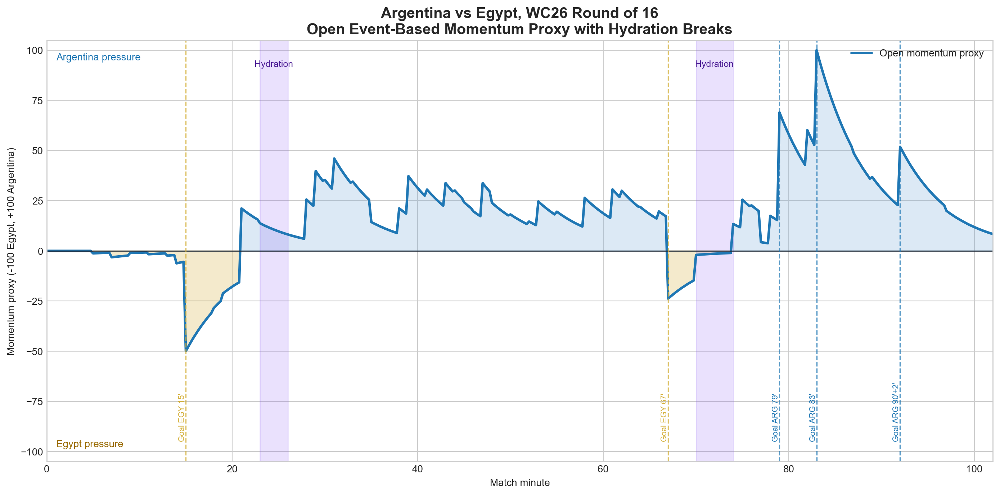

# World Cup Momentum Breaks

Notebook-first mini project to approximate World Cup 2026 match momentum from public FIFA event data and study hydration breaks.

Current first case study:

- Match: Argentina 3-2 Egypt
- Competition: FIFA World Cup 2026
- Stage: Round of 16
- FIFA match id: `400021528`

The first notebook collects FIFA public calendar, live, and timeline JSON for the match and identifies official hydration break intervals.

## Current Outputs

The second notebook builds a first open event-based momentum proxy:

- [Event table](data/processed/argentina_egypt_400021528_events.csv)
- [Momentum curve data](data/processed/argentina_egypt_400021528_momentum.csv)
- [Hydration break intervals](data/processed/argentina_egypt_400021528_hydration_breaks.csv)
- [Before/after break summary](data/processed/argentina_egypt_400021528_break_summary.csv)
- [Momentum chart](reports/figures/argentina_egypt_400021528_momentum_proxy.png)

Early descriptive result from the first proxy:

| Break | Interval | Avg. momentum before | Avg. momentum after | Shift |
| --- | --- | ---: | ---: | ---: |
| 1 | 23' to 26' | -5.38 | 23.62 | +29.00 |
| 2 | 70' to 74' | -4.23 | 18.42 | +22.65 |

Positive values favor Argentina; negative values favor Egypt.
