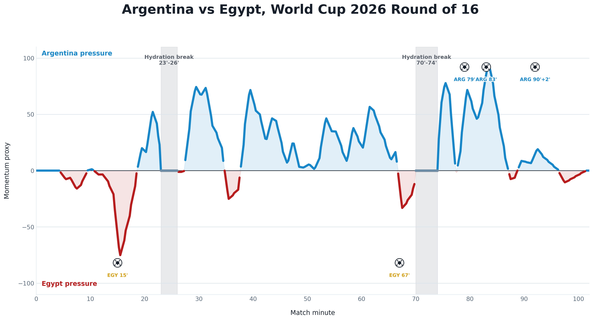

# World Cup Momentum Breaks

Script-first mini project to approximate World Cup 2026 match momentum from public FIFA event data and study hydration breaks.

Current first case study:

- Match: Argentina 3-2 Egypt
- Competition: FIFA World Cup 2026
- Stage: Round of 16
- FIFA match id: `400021528`

The pipeline collects FIFA public calendar, live, and timeline JSON for the match, builds an open momentum proxy, and exports polished charts for sharing.

## Reproduce

Run the full local workflow from the repo root:

```bash
python3 scripts/collect_argentina_egypt_data.py
python3 scripts/build_momentum_proxy.py
python3 scripts/make_linkedin_chart.py
```

The collection script reuses existing raw JSON files when they are present and fetches from FIFA only when a raw payload is missing.

## Current Outputs

The momentum script builds an Opta-inspired open proxy:

- Assign a capped `0.0` to `0.1` public-event value to visible FIFA timeline events.
- Keep each team's maximum event value per minute instead of summing every event.
- Weight the last four minutes most heavily.
- Force hydration-break intervals to zero because play is stopped.

- [Event table](data/processed/argentina_egypt_400021528_events.csv)
- [Momentum curve data](data/processed/argentina_egypt_400021528_momentum.csv)
- [Per-minute momentum values](data/processed/argentina_egypt_400021528_momentum_per_minute.csv)
- [Hydration break intervals](data/processed/argentina_egypt_400021528_hydration_breaks.csv)
- [Before/after break summary](data/processed/argentina_egypt_400021528_break_summary.csv)
- [Momentum chart](reports/figures/argentina_egypt_400021528_momentum_proxy.png)
- [LinkedIn-ready chart](reports/figures/argentina_egypt_400021528_momentum_linkedin.png)
- [LinkedIn-ready SVG](reports/figures/argentina_egypt_400021528_momentum_linkedin.svg)




Early descriptive result from the revised proxy:

| Break | Interval | Avg. momentum before | Avg. momentum after | Shift |
| --- | --- | ---: | ---: | ---: |
| 1 | 23' to 26' | 22.41 | 41.38 | +18.96 |
| 2 | 70' to 74' | -10.04 | 42.04 | +52.07 |

Positive values favor Argentina; negative values favor Egypt.
