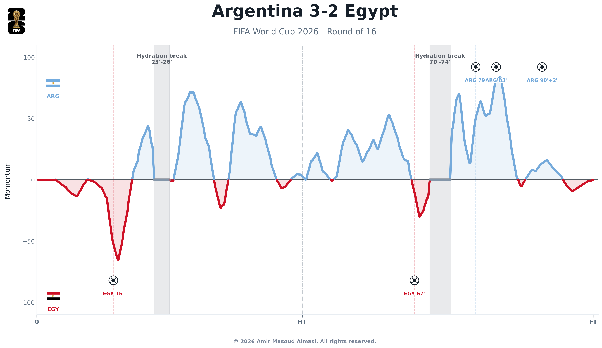
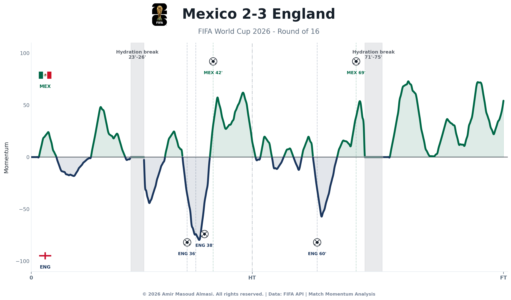
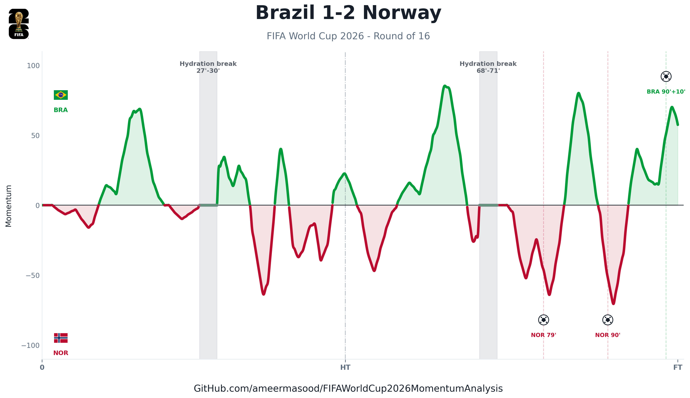

# World Cup Match Momentum & Hydration Breaks

Python pipeline to calculate match momentum from public FIFA event timeline data and analyze play segments around hydration breaks.

## Features

- **Continuous Sliding Momentum**: Calculates momentum over a rolling grid (0.25-minute steps) using weighted threat lookbacks (4-minute window) and localized field danger levels.
- **Dynamic Charting**: Interpolates data to high-resolution grids for smooth curves, styles figures with official team colors and dynamically fetched country flags, and centers titles with final match scores.
- **Watermarked Graphics**: Places the official FIFA World Cup 2026 logo at the top left of the figure and stamps a clean copyright notice at the bottom.
- **Descriptive Naming**: Organizes processed outputs and visualizations in stage/team directories (e.g., `Round_of_16_Argentina_Egypt/`).

## How to Run

### Install Dependencies
```bash
pip install -r requirements.txt
```

### Process All Knockout Stage Matches
Harvest and render charts for all available tournament knockout stage matches:
```bash
python3 run_pipeline.py --all-knockouts
```
*Note: Unplayed/future matches are detected and skipped automatically without crashing.*

### Process a Single Match
Run the complete collection, calculation, and charting steps for a specific match:

**By Match ID:**
```bash
python3 run_pipeline.py --match-id 400021528
```

**By Team Abbreviation:**
```bash
python3 run_pipeline.py --teams ARG EGY
```

---

## Directory Structure & Outputs

- **Raw API Payloads**: `data/raw/match_{match_id}/` (stores `live.json`, `timeline.json`, and `calendar.json`)
- **Cached Flags**: `data/flags/` (caches flags fetched from FlagCDN)
- **Processed Datasets**: `data/processed/{Stage}_{Home}_{Away}/`
  - `{Stage}_{Home}_{Away}_events.csv` (scored events)
  - `{Stage}_{Home}_{Away}_momentum_grid.csv` (interpolated momentum time-series)
  - `{Stage}_{Home}_{Away}_hydration_breaks.csv` (resolved hydration intervals)
  - `{Stage}_{Home}_{Away}_break_summary.csv` (average momentum before/after breaks)
- **Visualizations**: `reports/figures/{Stage}_{Home}_{Away}/`
  - `{Stage}_{Home}_{Away}_momentum_chart.png` (polished graphic)
  - `{Stage}_{Home}_{Away}_momentum_chart.svg` (vector format)

---

## Calculation Methodology

1. **Possession Value Proxy ($PV$):**
   Events are mapped to a threat score capped at $0.10$:
   - **Goal**: $0.10$
   - **Penalty Awarded**: $0.085$
   - **Attempt at Goal**: $0.035 + 0.045 \times \text{danger}$ (where $\text{danger} = 1.0 - \frac{\min(x, 100-x)}{50}$ and $x$ is the horizontal pitch coordinate)
   - **Corner**: $0.025$
   - **Goal Prevention (Save)**: $0.04$
   - **Foul**: $0.008 + 0.022 \times \text{danger}$
   - **Offside**: $0.01$

2. **Continuous Team Threat ($T_{team}$):**
   Computed over a rolling 4-minute window:
   $$T_{team}(t) = \sum_{l=0}^{3} w_l \cdot \max_{\tau \in (t - (l+1), t - l]} PV_{team}(\tau)$$
   Weights ($w_0 = 1.0$, $w_1 = 0.75$, $w_2 = 0.5$, $w_3 = 0.25$) discount older threats.

3. **Momentum ($M_{smoothed}$):**
   Difference between home and away threats scaled to range $[-100, 100]$:
   $$M(t) = 100 \cdot \frac{T_{Home}(t) - T_{Away}(t)}{\max_{t'} |T_{Home}(t') - T_{Away}(t')|}$$
   Smoothed using a centered moving average over 5 grid points. Forced to $0.0$ during hydration breaks.

---

## Example Visualizations

### Argentina vs Egypt (Round of 16)


### Mexico vs England (Round of 16)


### Brazil vs Norway (Round of 16)

