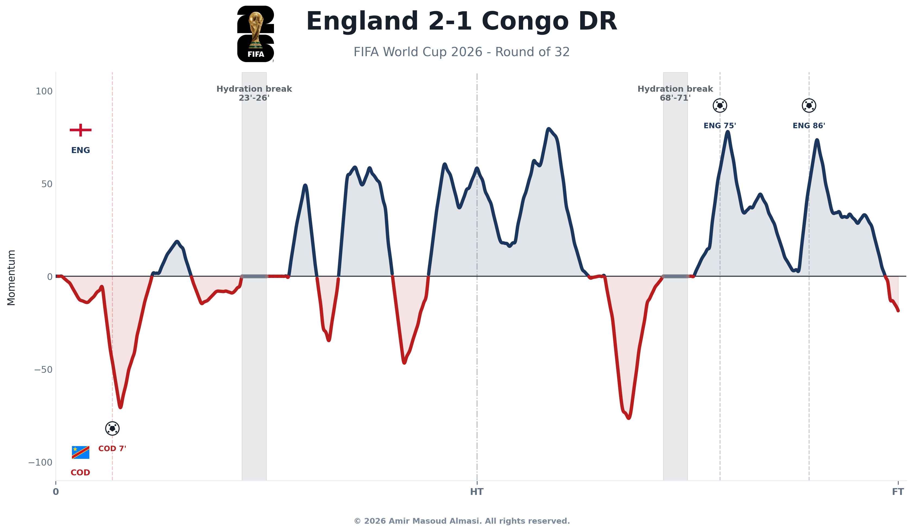
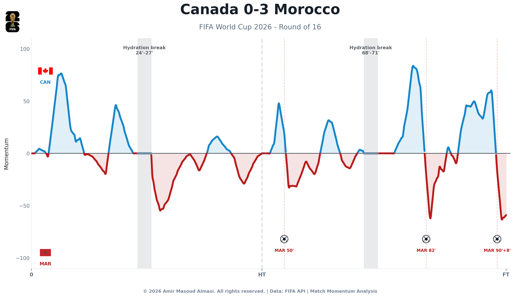

# World Cup Match Momentum & Hydration Breaks

This project is a Python-based analysis tool that downloads public event feeds from the FIFA API to reconstruct match momentum curves for the FIFA World Cup 2026. 

By analyzing in-game event flows (such as goals, penalty decisions, saves, and card warnings), the pipeline maps out threat scores for both home and away teams. It smooths these rolling values using cubic spline interpolation to produce clean momentum graphics. Additionally, the project highlights play segments and shifts in momentum directly before and after FIFA's official hydration breaks to study the tactical impact of those interruptions.


## How to Run

### Install Dependencies
```bash
pip install -r requirements.txt
```

### Process All Knockout Stage Matches
Harvest and render charts for all available tournament knockout stage matches:
```bash
python3 main.py --all-knockouts
```
*Note: Unplayed/future matches are detected and skipped automatically without crashing.*

### Process a Single Match
Run the complete collection, calculation, and charting steps for a specific match:

**By Match ID:**
```bash
python3 main.py --match-id 400021528
```

**By Team Abbreviation:**
```bash
python3 main.py --teams ARG EGY
```

---

## Directory Structure & Outputs

- **Raw API Payloads**: `data/raw/match_{match_id}/` (stores `live.json`, `timeline.json`, and `calendar.json`)
- **Cached Flags**: `data/flags/` (caches flags fetched from FlagCDN)
- **Processed Datasets**: `data/processed/{Stage}_{Home}_{Away}/`
  - `{Stage}_{Home}_{Away}_events.csv` (scored events)
  - `{Stage}_{Home}_{Away}_momentum_grid.csv` (interpolated momentum time-series)
  - `{Stage}_{Home}_{Away}_hydration_breaks.csv` (resolved hydration intervals)
  - `{Stage}_{Home}_{Away}_break_summary.csv` (average momentum before/after breaks)
- **Visualizations**: `reports/figures/{Stage}_{Home}_{Away}/`
  - `{Stage}_{Home}_{Away}_momentum_chart.png` (polished graphic)
  - `{Stage}_{Home}_{Away}_momentum_chart.svg` (vector format)

---

## Calculation Methodology

1. **Possession Value Proxy ($PV$):**
   Events are mapped to a threat score capped at $0.10$:
   - **Goal**: $0.10$
   - **Penalty Awarded**: $0.085$
   - **Attempt at Goal**: $0.035 + 0.045 \times \text{danger}$ (where $\text{danger} = 1.0 - \frac{\min(x, 100-x)}{50}$ and $x$ is the horizontal pitch coordinate)
   - **Corner**: $0.025$
   - **Goal Prevention (Save)**: $0.04$
   - **Foul**: $0.008 + 0.022 \times \text{danger}$
   - **Offside**: $0.01$

2. **Continuous Team Threat ($T_{team}$):**
   Computed over a rolling 4-minute window:
   $$T_{team}(t) = \sum_{l=0}^{3} w_l \cdot \max_{\tau \in (t - (l+1), t - l]} PV_{team}(\tau)$$
   Weights ($w_0 = 1.0$, $w_1 = 0.75$, $w_2 = 0.5$, $w_3 = 0.25$) discount older threats.

3. **Momentum ($M_{smoothed}$):**
   Difference between home and away threats scaled to range $[-100, 100]$:
   $$M(t) = 100 \cdot \frac{T_{Home}(t) - T_{Away}(t)}{\max_{t'} |T_{Home}(t') - T_{Away}(t')|}$$
   Smoothed using a centered moving average over 5 grid points. Forced to $0.0$ during hydration breaks.

---

## Do Hydration Breaks Benefit the Underdog?

Common wisdom suggests that mid-half cooling stoppages are a lifesaver for underdogs, letting exhausted players regroup and catch their breath to hold off dominant teams. However, after compiling and analyzing the momentum data across **50 hydration breaks** in **25 tournament knockout matches**, we found that these pauses act as **forced tactical timeouts** that heavily benefit the favorites. 

### The Reset and the Comeback
When play stops for 2-4 minutes, it acts as a physical and mental **circuit breaker**. It completely halts the underdog’s high-intensity emotional pressing flow, resetting the game tempo to a cold, neutral state. 

* **The Equalizer Effect**: Across all matches, the team trailing in momentum before a break managed to turn things around and gain momentum post-break **74.0% of the time**. In **52.0% of cases**, the stoppage resulted in a complete swap of the team holding the momentum lead.
* **The Favorite's Lifeline**: When the higher-ranked favorite was trailing in momentum going into a break, they used the pause to stage a comeback **72.2% of the time**. In **69.2% of those comebacks**, the favorite completely flipped the momentum lead away from the underdog. During the timeout, the favorite's coaching staff can make the adjustments necessary to reassert their superior technical class.

---

## Tactical Cases in Visuals

### 1. The Classic Comeback: Argentina vs. Egypt (Round of 16)
Egypt (red) established a clear momentum advantage over Argentina (blue) leading up to the 70th-minute mark. When the referee blew for the second hydration break (visible at the 70' to 74' gap), it completely flattened Egypt's rhythm. Argentina regrouped during the timeout, adjusted their midfield lines, registered a massive **+50.84 point shift**, and swept control of the match to secure their late-game victory.


### 2. The Complete Flip: England vs. Congo DR (Round of 32)
Congo DR (red) was holding onto a strong momentum lead. The second break (68' to 71') acted as a hard circuit breaker. Post-break, England (blue) registered a **+65.24 point momentum swing**—the largest post-break shift in the tournament—completely erasing Congo DR's presence for the remainder of the match.



### 3. Killing the Pressure: Canada vs. Morocco (Round of 16)
Canada (blue) had built a strong, high-pressure momentum lead in the first half. A first-half hydration break in the 24th minute halted their flow immediately. Play restarted cold, Canada's pressing intensity dropped, and Morocco (red) capitalized on the reset to claim a **+60.66 point momentum shift**.


---

## The "100% Collapse" of Extreme Dominance

Beyond individual matches, our aggregate data shows that **extreme dominance before a hydration break makes a team highly vulnerable to a drop in control**. When we isolated the 12 breaks where a team held a massive average momentum lead ($\ge 25$ points) immediately before the stoppage:

* **100% Momentum Drop**: In **12 out of 12 cases**, the dominant team lost momentum after play resumed. 
* **Volatile Shifts**: The average momentum shift under Extreme Dominance was **25.77 points**, compared to only **16.68 points** under Mild Dominance ($\le 10$ points before the break).
* **The Tactical Takeaway**: The hydration break functions as a hard ceiling for game control. Under our model, if a team enters a hydration break carrying extreme dominance, they have a **100% historical probability of suffering a momentum drop** once play restarts.

---

## Disclaimer & Terms of Use

* **Personal & Educational Use**: This is a personal, non-commercial sports data research project developed solely for educational and analytical purposes.
* **Non-Affiliation**: This project is not affiliated with, authorized, sponsored, or endorsed by FIFA, the FIFA World Cup, or any national football associations. 
* **Copyright Notice**: All visualization designs, momentum metrics, and analytical code are © 2026 Amir Masoud Almasi. All rights reserved. Country flags are loaded dynamically for educational references from public third-party APIs.
